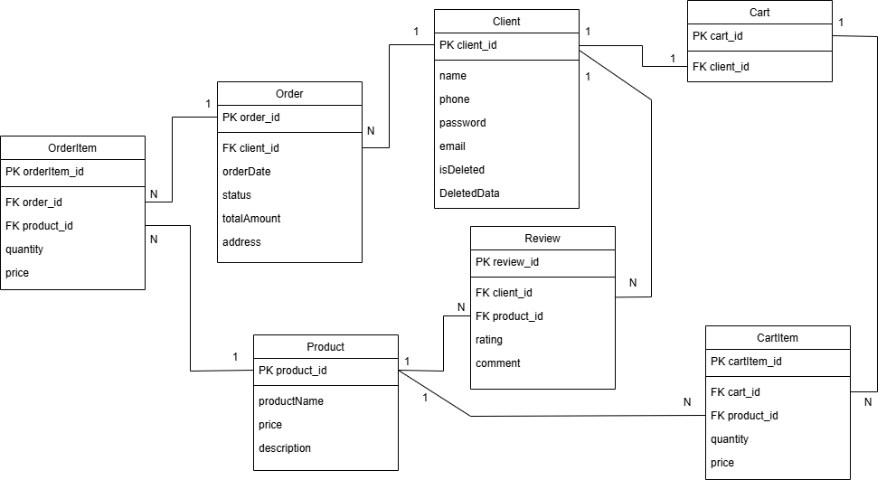

# 🛍️ StationeryShop - API для интернет-магазина канцтоваров

API сервис для покупки канцелярских товаров с возможностью:

- Просмотра каталога товаров
- Добавления товаров в корзину
- Оформления заказа
- Оставления отзывов о товарах
- Управления профилем

## ✨ Особенности

- RESTful API на .NET 8
- Swagger документация
- Entity Framework Core

## 📚 Документация API

Доступна по адресу: `https://localhost:7038/swagger/index.html`

## 🛠️ Структура проекта

```
StationeryShop/
├── Properties/        # Конфигурации сборки и запуска
├── Controllers/       # API контроллеры
├── Data/              # Исходные данные для инициализации БД
├── DTOs/              # DTO
│  ├── Auth/           # DTO логин/регистрация
│  ├── Cart/           # DTO корзины
│  ├── Order/          # DTO заказов
│  ├── Product/        # DTO товаров
│  ├── Review/         # DTO отзывов
│  └── User/           # DTO пользователей
├── Migrations/        # Миграции базы данных
├── Models/            # Сущности базы данных
├── PasswordHasher/    # Хеширование паролей
├── Services/          # Бизнес-логика приложения
├── appsettings.json   # Конфигурация приложения
└── Program.cs         # Точка входа
```

## 🔑 ER-диаграмма



## 📊 Таблицы эндпоинтов

### 🔐 Аутентификация

| Метод  | Путь                      | Описание                     | Требуется аутентификация | Swagger | Postman |
|--------|---------------------------|------------------------------|--------------------------|---------|---------|
| POST   | `/api/Auth/register`      | Регистрация пользователя     | Нет                      | [Swagger](swagger/register.png)| [Postman](postman/register.png)|
| POST   | `/api/Auth/login`         | Вход в систему               | Нет                      | [Swagger](swagger/login.png)| [Postman](postman/login.png)|
| POST   | `/api/Auth/logout`        | Выход из системы             | Да                       | [Swagger](swagger/logout.png)|  [Postman](postman/logout.png)|

### 🛍️ Товары

| Метод  | Путь                      | Описание                     | Требуется аутентификация | Swagger | Postman |
|--------|---------------------------|------------------------------|--------------------------|---------|---------|
| GET    | `/api/Products`           | Список всех товаров          | Нет                      | [Swagger](swagger/get_all_products.png)| [Postman](postman/get_all_products.png)|
| GET    | `/api/Products/{productid}`| Получить товар по ID         | Нет                      | [Swagger](swagger/get_product_by_id.png)| [Postman](postman/get_product_by_id.png)|
| GET    | `/api/Products/search`     | Получить товары по названию  | Нет                      | [Swagger](swagger/get_product_by_name.png)| [Postman](postman/get_product_by_name.png)|

### 🛒 Корзина

| Метод  | Путь                      | Описание                              | Требуется аутентификация | Swagger | Postman |
|--------|---------------------------|---------------------------------------|--------------------------|---------|---------|
| GET    | `/api/SessionCart`        | Получить содержимое сессионной корзины| Нет                      | [Swagger](swagger/get_session_cart.png)| [Postman](postman/get_session_cart.png)|
| POST   | `/api/SessionCart/items`  | Добавить товар в сесионную коризну<br>(увеличить количество товара в сессионной корзине)   | Нет                      | [Swagger](swagger/post_add_to_session_cart.png)| [Postman](postman/post_add_to_session_cart.png)|
| DELETE | `/api/SessionCart/items/{productid}`| Удалить товар из сесионной коризны           | Нет                      | [Swagger](swagger/delete_product_from_session_cart.png)| [Postman](postman/delete_product_from_session_cart.png)|
| PUT    | `/api/SessionCart/items/{productid}/decrease`        | Уменьшить количество товара в сесионной корзине<br>(удалить товар из сесионной коризны)| Нет                      | [Swagger](swagger/put_decrease_product_in_session_cart.png)| [Postman](postman/put_decrease_product_in_session_cart.png)|
| GET    | `/api/Cart`               | Получить содержимое корзины           | Да                       | [Swagger](swagger/get_cart.png)| [Postman](postman/get_cart.png)|
| POST   | `/api/Cart/items`         | Добавить товар в коризну<br>(увеличить количество товара в корзине)   | Да                       | [Swagger](swagger/post_add_to_cart.png)| [Postman](postman/post_add_to_cart.png)|
| DELETE | `/api/Cart/items/{productid}`| Удалить товар из коризны           | Да                       | [Swagger](swagger/delete_product_from_cart.png)| [Postman](postman/delete_product_from_cart.png)|
| PUT    | `/api/Cart/items/{productid}/decrease`        | Уменьшить количество товара в корзине<br>(удалить товар из коризны)| Да                       | [Swagger](swagger/put_decrease_product_in_cart.png)| [Postman](postman/put_decrease_product_in_cart.png)|

### ⭐ Отзывы

| Метод  | Путь                      | Описание                              | Требуется аутентификация | Swagger | Postman |
|--------|---------------------------|---------------------------------------|--------------------------|---------|---------|
| GET    | `/api/Reviews/product/{productid}`| Получить отзывы на товар      | Нет                      | [Swagger](swagger/get_reviews.png)| [Postman](postman/get_review.png)|
| POST   | `/api/Reviews`            | Добавить отзыв на товар               | Да                       | [Swagger](swagger/post_review.png)| [Postman](postman/post_review.png)|

### 📦 Заказы

| Метод  | Путь                      | Описание                              | Требуется аутентификация | Swagger | Postman |
|--------|---------------------------|---------------------------------------|--------------------------|---------|---------|
| POST   | `/api/Orders`              | Оформить заказ                        | Да                       | [Swagger](swagger/post_create_order.png)| [Postman](postman/post_create_order.png)|
| GET    | `/api/Orders`              | Получить заказы клиента               | Да                       | [Swagger](swagger/get_client_orders.png)| [Postman](postman/get_client_orders.png)|

### 👤 Клиент

| Метод  | Путь                      | Описание                              | Требуется аутентификация | Swagger | Postman |
|--------|---------------------------|---------------------------------------|--------------------------|---------|---------|
| GET    | `/api/Clients/me`         | Получить информацию о клиенте         | Да                       | [Swagger](swagger/get_client_info.png)| [Postman](postman/get_client_info.png)|
| PUT    | `/api/Clients/me`         | Обновить информацию о клиенте         | Да                       | [Swagger](swagger/put_client_update.png)| [Postman](postman/put_client_update.png)|
| DELETE | `/api/Clients/me`         | Удалить аккаунт                       | Да                       | [Swagger](swagger/delete_client.png)| [Postman](postman/delete_client.png)|
